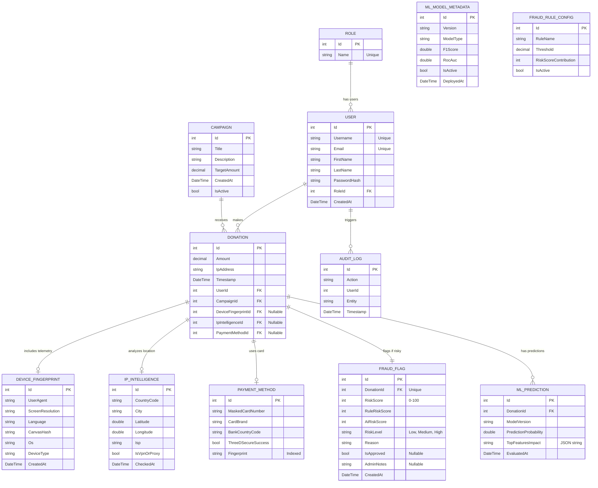

# Fraud Detection & Machine Learning System
## Technical & Architectural Documentation Report

This document provides a comprehensive overview of the **Donation Fraud Detection System**, detailing the project directory structure, relational database schema, and the workflow of the two-layer hybrid fraud detection engine (Deterministic Heuristic Rules + Predictive Machine Learning).

---

## 1. Project Directory Structure

The project is structured as a full-stack application composed of an **ASP.NET Core Web API backend**, an **Angular frontend web application**, and integration hooks for an external **FastAPI Python Machine Learning microservice**.

```text
Fraud_Detection_Project/
├── APIs/                                   # Backend codebase
│   ├── Project_Fraud_Detection.sln        # Visual Studio Solution file
│   ├── DonationFraud.API/                  # Core ASP.NET Core API Project
│   │   ├── Controllers/                    # HTTP Endpoints (Auth, Campaigns, Donations, Fraud)
│   │   ├── Data/                           # Entity Framework DbContext & DB Migrations
│   │   ├── DTOs/                           # Data Transfer Objects & API response models
│   │   ├── Entities/                       # Domain Entities mapped to Database Tables
│   │   │   ├── AuditEntities.cs            # Audit log entity
│   │   │   ├── ConfigEntities.cs           # Heuristic rule configs (thresholds, weights)
│   │   │   ├── CoreEntities.cs             # Identity & Campaigns (User, Role, Campaign)
│   │   │   ├── DonationEntities.cs         # Core transaction & fraud status models
│   │   │   └── MlEntities.cs               # ML telemetry & model metadata models
│   │   ├── Enums/                          # Shared Enums (RiskLevel, etc.)
│   │   ├── FraudEngine/                    # Layer 1: Rule-based Heuristic Engine
│   │   │   └── AllFraudEngine.cs           # Rule implementations (HighFrequency, SameIP, Spike)
│   │   ├── Interfaces/                     # Service Contract Interfaces
│   │   ├── Middleware/                     # Custom request/response handling middleware
│   │   ├── Repositories/                   # DB Query Abstraction Layer
│   │   ├── Services/                       # Core Business Logic Layer
│   │   │   ├── DonationService.cs          # Orchestrates donations, records telemetry
│   │   │   ├── FraudDetectionService.cs    # Evaluates Layer 1 + Layer 2, blends risk score
│   │   │   ├── FraudManagementService.cs   # Admin review, notes, stats, and manual review overrides
│   │   │   ├── MlInferenceService.cs       # Feature engineering, REST client for FastAPI, mock fallback
│   │   │   └── AuthService.cs              # User authentication & token management
│   │   ├── Program.cs                      # Application Entry Point & DI Container setup
│   │   └── appsettings.json                # Server configurations (DB connection, weights, URL)
│   └── Tests/                              # Backend Unit & Integration Tests
│
├── UI/                                     # Frontend codebase
│   └── Frontend_Fraud_Detection/           # Angular 17+ Client App
│       ├── src/
│       │   ├── app/                        # Bootstrapping & global routes
│       │   ├── components/                 # Shared UI elements (e.g., review-modal)
│       │   ├── pages/                      # Main views (Dashboards, Campaigns, Auth)
│       │   ├── services/                   # HTTP client integration with ASP.NET API
│       │   ├── guards/                     # Navigation route protection guards
│       │   └── styles.css                  # Tailwind CSS & global styles stylesheet
│
└── Docs/                                   # Visual Assets & System Documentation
    ├── Home page.png                       # UI Screenshots
    ├── Admin Dashboard.png                 
    ├── User Dashboard 1.png                
    ├── User Dashboard 2.png                
    └── ML_Project_Report.md                # This Report Document
```

---

## 2. Database Schema & Architecture

The database is built on **Microsoft SQL Server** and managed using **Entity Framework Core** with a code-first migrations workflow. It consists of **12 tables** split into five distinct functional domains: Identity, Campaigns, Transactions, Machine Learning Telemetry, and Auditing/System Configuration.

### 2.1 Entity Relationship Diagram (ERD)

The diagram below represents the relationships between the database tables:



### 2.2 Table Definitions & Specifications

#### 1. Roles (`Roles` Table)
Stores user security roles for application access control.
* **Id** (`int`, Primary Key, Identity): Unique role identifier.
* **Name** (`nvarchar(max)`): Name of the role (e.g., `"Admin"`, `"User"`).

#### 2. Users (`Users` Table)
Stores user profile information, credentials, and associated security roles.
* **Id** (`int`, Primary Key, Identity): Unique user identifier.
* **Username** (`nvarchar(450)`, Unique Index): Unique username.
* **Email** (`nvarchar(450)`, Unique Index): Unique email address.
* **FirstName** / **LastName** (`nvarchar(max)`): Profile names.
* **PasswordHash** (`nvarchar(max)`): Salted and hashed password.
* **RoleId** (`int`, Foreign Key -> `Roles.Id`): Associated user role (Cascading restricted).
* **CreatedAt** (`datetime2`): Account creation timestamp.

#### 3. Campaigns (`Campaigns` Table)
Represents fundraising initiatives that accept donations.
* **Id** (`int`, Primary Key, Identity): Unique campaign identifier.
* **Title** (`nvarchar(max)`): Campaign title.
* **Description** (`nvarchar(max)`): Campaign description.
* **TargetAmount** (`decimal(18,2)`): Financial target for the campaign.
* **IsActive** (`bit`): Flag indicating if the campaign is open for donations (auto-closed once TargetAmount is met).
* **CreatedAt** (`datetime2`): Campaign creation timestamp.

#### 4. DeviceFingerprints (`DeviceFingerprints` Table)
Captures web client telemetry used to verify session integrity and detect mismatches.
* **Id** (`int`, Primary Key, Identity): Unique fingerprint identifier.
* **UserAgent** (`nvarchar(max)`): Full browser user agent string.
* **ScreenResolution** (`nvarchar(max)`): Client display dimensions (e.g., `"1920x1080"`).
* **Language** (`nvarchar(max)`): Browser display language (e.g., `"en-US"`).
* **CanvasHash** (`nvarchar(max)`): Unique hash generated by canvas fingerprinting.
* **Os** (`nvarchar(max)`): Extracted operating system name.
* **DeviceType** (`nvarchar(max)`): Form factor (e.g., `"Desktop"`, `"Mobile"`).
* **CreatedAt** (`datetime2`): Capture timestamp.

#### 5. IpIntelligences (`IpIntelligences` Table)
Stores IP geolocation and network characteristics to detect VPNs and geo-anomalies.
* **Id** (`int`, Primary Key, Identity): Unique record identifier.
* **CountryCode** (`nvarchar(max)`): Two-letter country code (e.g., `"IN"`, `"US"`).
* **City** (`nvarchar(max)`): City name resolved from the IP address.
* **Latitude** / **Longitude** (`float`): Approximate coordinates.
* **Isp** (`nvarchar(max)`): Internet Service Provider name.
* **IsVpnOrProxy** (`bit`): High-risk flag indicating network maskers.
* **CheckedAt** (`datetime2`): Lookup timestamp.

#### 6. PaymentMethods (`PaymentMethods` Table)
Stores card attributes and custom fingerprints for card velocity calculations.
* **Id** (`int`, Primary Key, Identity): Unique record identifier.
* **MaskedCardNumber** (`nvarchar(max)`): Obfuscated card number for security (e.g., `"411111XXXXXX1111"`).
* **CardBrand** (`nvarchar(max)`): Card network (e.g., `"Visa"`, `"Mastercard"`).
* **BankCountryCode** (`nvarchar(max)`): Country code of the card issuer bank.
* **ThreeDSecureSuccess** (`bit`): Indicates if 3D Secure verification passed.
* **Fingerprint** (`nvarchar(450)`, Indexed): Secure hash derived from the raw credit card number (non-reversible) to track cards across multiple transactions.

#### 7. Donations (`Donations` Table)
Central transaction ledger. Integrates core contextual entities with telemetry and ML metadata.
* **Id** (`int`, Primary Key, Identity): Unique transaction identifier.
* **Amount** (`decimal(18,2)`): Transaction value.
* **IpAddress** (`nvarchar(max)`): Originating client IP address.
* **Timestamp** (`datetime2`): Transaction timestamp.
* **UserId** (`int`, Foreign Key -> `Users.Id`): User making the donation (Restrict delete).
* **CampaignId** (`int`, Foreign Key -> `Campaigns.Id`): Target campaign (Restrict delete).
* **DeviceFingerprintId** (`int?`, Foreign Key -> `DeviceFingerprints.Id`): Nullable, set to null on delete.
* **IpIntelligenceId** (`int?`, Foreign Key -> `IpIntelligences.Id`): Nullable, set to null on delete.
* **PaymentMethodId** (`int?`, Foreign Key -> `PaymentMethods.Id`): Nullable, set to null on delete.

#### 8. FraudFlags (`FraudFlags` Table)
Stores risk scoring metadata, triggering reasons, and administrative review statuses.
* **Id** (`int`, Primary Key, Identity): Unique flag identifier.
* **DonationId** (`int`, Foreign Key -> `Donations.Id`, One-to-One): Direct relation to the donation (Cascade delete).
* **RiskScore** (`int`): Blended score (0 to 100).
* **RuleRiskScore** (`int`): Combined score of the Layer 1 Heuristics.
* **AiRiskScore** (`int`): Prediction score from the Layer 2 AI Model.
* **RiskLevel** (`int`): Enum representing threat tier (`Low = 0`, `Medium = 1`, `High = 2`).
* **Reason** (`nvarchar(max)`): Concatenated rule names and ML model details outlining why the donation was flagged.
* **IsApproved** (`bit?`): Admin review outcome. `null` (Pending review), `true` (Override/Approved), `false` (Blocked/Refunded).
* **AdminNotes** (`nvarchar(max)`, Nullable): Notes from the reviewing administrator.
* **CreatedAt** (`datetime2`): Timestamp when the flag was raised.

#### 9. MlPredictions (`MlPredictions` Table)
Stores raw prediction outputs for audit trails and machine learning drift analysis.
* **Id** (`int`, Primary Key, Identity): Unique prediction identifier.
* **DonationId** (`int`, Foreign Key -> `Donations.Id`): Associated donation (Cascade delete).
* **ModelVersion** (`nvarchar(max)`): Active version of the model (e.g., `"Mock_v1-rules"` or `"FastAPI_XGBoost_v2"`).
* **PredictionProbability** (`float`): Raw confidence level (0.0 to 1.0) returned by the classifier.
* **TopFeaturesImpact** (`nvarchar(max)`): JSON dictionary mapping features and their respective SHAP/weight contributions.
* **EvaluatedAt** (`datetime2`): Evaluation timestamp.

#### 10. MlModelMetadata (`MlModelMetadata` Table)
Maintains deployment records, metrics, and active states of ML models.
* **Id** (`int`, Primary Key, Identity): Unique metadata identifier.
* **Version** (`nvarchar(max)`): Model identifier string.
* **ModelType** (`nvarchar(max)`): Algorithm used (e.g., `"XGBoost Classifier"`, `"Random Forest"`).
* **F1Score** / **RocAuc** (`float`): Evaluation metrics for model governance.
* **IsActive** (`bit`): Indicates if this version should receive inference requests.
* **DeployedAt** (`datetime2`): Deployment timestamp.

#### 11. FraudRuleConfigs (`FraudRuleConfigs` Table)
Database-driven settings containing thresholds and weights for the deterministic rule engine.
* **Id** (`int`, Primary Key, Identity): Unique rule config identifier.
* **RuleName** (`nvarchar(max)`): Code identifier for the rule (e.g., `"HighFrequency"`, `"SameIP"`, `"SpikeAmount"`).
* **Threshold** (`decimal(18,2)`): Numeric threshold checked by the rule logic.
* **RiskScoreContribution** (`int`): Threat score added if the threshold is violated.
* **IsActive** (`bit`): Active rule switch.

#### 12. AuditLogs (`AuditLogs` Table)
Provides system-wide activity logs for security and admin actions.
* **Id** (`int`, Primary Key, Identity): Unique audit log identifier.
* **Action** (`nvarchar(max)`): Summary of action performed.
* **UserId** (`int`): Identifier of the user triggering the audit.
* **Entity** (`nvarchar(max)`): Target table name or feature context.
* **Timestamp** (`datetime2`): Audit creation timestamp.

---

## 3. Fraud Detection Workflow & Working

The core of the application lies in the hybrid, 2-layer fraud detection engine orchestrating heuristic rules and machine learning predictions to guard donation endpoints.

### 3.1 Overview of the Detection Architecture

The pipeline uses a multi-layered check:

```mermaid
flowchart TD
    A[User Submits Donation] --> B[Generate & Save Telemetry]
    B --> B1[Device Fingerprint]
    B --> B2[IP Intelligence]
    B --> B3[Payment Card Fingerprint]
    
    B1 & B2 & B3 --> C[Save Donation Record]
    C --> D[FraudDetectionService.EvaluateAndFlagDonationAsync]
    
    %% Layer 1 Rules
    D --> E[Layer 1: Deterministic Rules Engine]
    E --> E1[HighFrequencyRule]
    E --> E2[SameIPRule]
    E --> E3[SpikeRule]
    E1 & E2 & E3 --> F[Calculate RuleRiskScore]
    
    %% Layer 2 ML
    D --> G[Layer 2: MlInferenceService]
    G --> H{FastAPI Python Service Running?}
    H -- Yes --> I[POST to /predict with Feature Vector]
    H -- No / Timeout --> J[Fallback: Mock Heuristic ML Engine]
    I --> K[Return AiRiskScore & SHAP JSON]
    J --> K
    
    %% Blending
    F & K --> L[Calculate Blended Risk Score]
    L --> M["Blended Score = (Rules * 0.4) + (AI * 0.6)"]
    
    %% Decisions
    M --> N{Blended Score >= 30?}
    N -- No [Score < 30] --> O[Transaction Allowed: Completed]
    N -- Yes [Score >= 30] --> P[Flag Donation as FraudFlag]
    P --> Q{RiskLevel == High [Score >= 70]?}
    Q -- Yes --> R[Block Transaction: Return HTTP 400 BadRequest]
    Q -- No [Medium Risk] --> S[Transaction Allowed: Queue for Admin Review]
```

---

### 3.2 Detailed Step-by-Step Execution

#### Step 1: Telemetry Collection & Persistence
When a user requests a donation:
* The client's **User Agent** and **IP Address** are captured by the controller.
* Mock telemetry generators simulate the creation of `DeviceFingerprint`, `IpIntelligence` (resolving ISP, City, coordinates, and VPN markers), and `PaymentMethod` (generating card fingerprints based on card inputs to track usage velocity).
* The contextual entities are saved first to generate valid foreign keys, and a `Donation` record is created.

#### Step 2: Layer 1 Evaluation (Deterministic Heuristic Rules)
The `FraudEvaluator` reads active rules from the `FraudRuleConfigs` table:
* **HighFrequencyRule**: Queries the database to count donations from this `UserId` in the last 15 minutes. Flags a risk if the count exceeds the database-configured threshold.
* **SameIPRule**: Counts donations from the same `IpAddress` in the last 15 minutes. Flags a risk if it exceeds the threshold.
* **SpikeRule**: Flags a risk if the current donation `Amount` is higher than the configured threshold.
* *Output*: A combined `RuleRiskScore` (capped at 100) and list of matched rules.

#### Step 3: Layer 2 Evaluation (Machine Learning Feature Engineering)
The `MlInferenceService` handles feature engineering, creating a 9-dimensional vector representing the transaction context:

| Feature Name | Type | Description / Calculation Method |
| :--- | :--- | :--- |
| `amount` | `double` | The raw value of the donation. |
| `ip_count_5m` | `int` | Count of donations originating from the same `IpAddress` in the last 5 minutes. |
| `user_attempts_10m` | `int` | Count of donation attempts by the same `UserId` in the last 10 minutes. |
| `account_age_days` | `double` | Number of days elapsed since the user's account creation (`UtcNow - User.CreatedAt`). |
| `card_count_1h` | `int` | Number of unique payment card fingerprints used by this user in the last hour. |
| `distance_ip_to_card_km` | `double` | Haversine distance between IP coordinates (latitude/longitude) and coordinates corresponding to the card bank country code. |
| `is_vpn_proxy` | `bool` | Boolean flag resolving if the originating IP address is an active VPN or proxy. |
| `screen_os_mismatch` | `bool` | Cross-matches the `DeviceFingerprint.Os` with user agent details (e.g., mobile user agents claiming to run Windows OS). |
| `amount_ratio_campaign_avg`| `double` | The ratio of the current donation amount to the overall average donation amount for this campaign. |

#### Step 4: Machine Learning Inference & Fallback
* **Microservice Query**: The C# client compiles the 9 features into a JSON payload and issues an HTTP POST request to `/predict` on the Python FastAPI microservice (running on `http://localhost:8000`).
* **Fast Inference Timeout**: The HTTP client enforces a tight **800ms timeout** threshold. This guarantees that user transaction times are not bottlenecked by server performance.
* **Graceful Fallback**: If the microservice is offline, timed out, or errors out, `MlInferenceService` handles the error silently and triggers its internal **Mock Heuristic ML engine** (`Mock_v1-rules`). This fallback computes an AI score based on mock weights:
  * VPN/Proxy active: **+25**
  * User used >2 unique cards in 1 hour: **+30**
  * Amount ratio > 5.0 of campaign average: **+20**
  * Client screen-OS mismatch: **+15**
  * Account age is under 24 hours: **+10**
  * *Output*: `AiRiskScore` (capped at 100), risk tier name, and a JSON impact string (mapping which features pushed the risk up).

#### Step 5: Risk Blending & Actions
The `FraudDetectionService` combines both scores using configured weights (`FraudEngine:RulesWeight` = 0.4, `FraudEngine:AiWeight` = 0.6):
$$\text{BlendedScore} = (0.4 \times \text{RuleRiskScore}) + (0.6 \times \text{AiRiskScore})$$

Three levels of action are determined:
1. **Low Risk (Score < 30)**: Transaction completes successfully.
2. **Medium Risk (Score 30 to 69)**: The transaction is processed, but a `FraudFlag` is generated with `IsApproved = null` (Pending review), highlighting triggering reasons. The campaign totals are updated.
3. **High Risk (Score >= 70)**: The transaction is **blocked**. A `FraudFlag` is created, and the endpoint returns a `400 BadRequest` to block charge authorization.

#### Step 6: Administrative Review & Governance
Administrators can log in to the Angular Frontend's Admin Dashboard to review pending or flagged transactions:
* **Approve**: If the admin verifies the donation is legitimate, they mark `IsApproved = true`. This updates statistics, flags the audit trail, and validates the campaign totals.
* **Block / Refund**: If verified as fraudulent, the admin marks `IsApproved = false`, initiating a block/refund workflow.
* Every administrative override logs the administrator's ID and custom notes to `FraudFlags.AdminNotes` and adds a log to `AuditLogs`.
